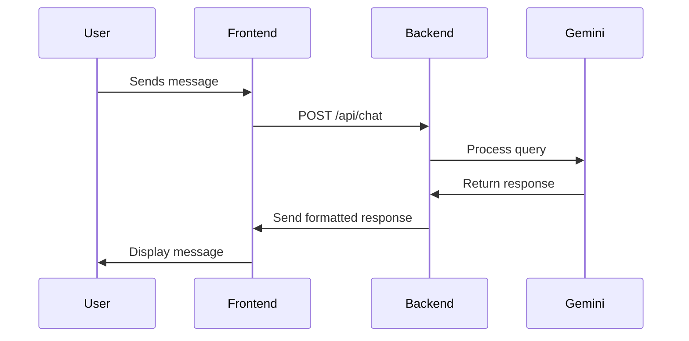
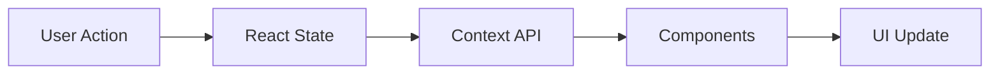

# FinWise - Architectural Specification

## System Overview
FinWise is an AI-powered financial advisor application specializing in Indian markets, built with a modern microservices architecture. The system leverages Google's Gemini 1.5 Flash model for intelligent financial analysis and advice.

## Architecture Components

### 1. Frontend Architecture (client-react/)
#### Technology Stack
- Framework: React with TypeScript
- Build Tool: Vite
- State Management: React Context API
- UI Framework: Material-UI (MUI)

#### Key Components
1. **Core Components**
   - `App.tsx`: Main application container
   - `ChatContainer`: Manages chat interface and message flow
   - `MessageList`: Handles message rendering and scrolling
   - `Navigation`: Manages routing and sidebar/mobile navigation

2. **Layout Components**
   - Desktop Layout:
     - Fixed left sidebar (300px width)
     - Main content area with dynamic chat
     - Auto-expanding input area
   - Mobile Layout:
     - Fixed top header (48px height)
     - Bottom navigation bar
     - Full-width content area

3. **Theme System**
   - Dark/Light mode support
   - Persistent theme preferences
   - Responsive design breakpoints
   - CSS Variables for consistent theming

4. **State Management**
   - Chat history state
   - User preferences
   - Navigation state
   - Theme state
   - Loading/Error states

### 2. Backend Architecture (server-python/)
#### Technology Stack
- Framework: Python (FastAPI)
- AI Model: Google Gemini 1.5 Flash
- WebSocket Support: FastAPI WebSocket
- CORS Handling: FastAPI CORS Middleware

#### Key Components
1. **API Layer**
   - RESTful endpoints for chat
   - WebSocket connections for real-time updates
   - Rate limiting middleware
   - Error handling middleware

2. **AI Integration**
   - Gemini model wrapper
   - Context management
   - Response formatting
   - Error handling

3. **Services**
   - Chat service
   - Market data service
   - User service (future)
   - Analytics service (future)

### 3. DevOps Architecture
#### Deployment Infrastructure
1. **Environment Management**
   - Development: devfinwise.rerecreation.us
     - Frontend: Port 3001
     - Backend: Port 9001
   - Production: finwise.rerecreation.us
     - Frontend: Port 3000
     - Backend: Port 9000

2. **Nginx Configuration**
   - SSL termination
   - Proxy configuration
   - Static file serving
   - Gzip compression
   - Cache control

3. **Docker Support**
   - Multi-stage builds
   - Development and production configurations
   - Volume management
   - Network isolation

4. **CI/CD Pipeline**
   - GitHub Actions workflow
   - Automated testing
   - Build verification
   - Deployment automation

### 4. Security Architecture
1. **Application Security**
   - HTTPS enforcement
   - CORS policy
   - Rate limiting
   - Input validation
   - XSS prevention

2. **API Security**
   - API key management
   - Request validation
   - Error handling
   - Logging

3. **Infrastructure Security**
   - Network isolation
   - Port restrictions
   - Environment separation
   - Secrets management

## Data Flow

### 1. Chat Flow

### 2. State Management Flow

## Scalability Considerations

### 1. Frontend Scaling
- Static asset CDN distribution
- Code splitting and lazy loading
- Service Worker for offline support
- Browser caching strategy

### 2. Backend Scaling
- Horizontal scaling capability
- Load balancer ready
- Stateless design
- Cache layer (future Redis integration)

### 3. Database Integration (Future)
- User data persistence
- Chat history storage
- Analytics data
- Cache layer

## Monitoring and Logging

### 1. Application Monitoring
- Error tracking
- Performance metrics
- User analytics
- API metrics

### 2. Infrastructure Monitoring
- Server health
- Resource utilization
- Network metrics
- Security events

### 3. Logging Strategy
- Centralized logging
- Log levels
- Log rotation
- Audit trails

## Development Workflow

### 1. Version Control
- Feature branch workflow
- Development branch for staging
- Main branch for production
- Pull request reviews

### 2. Testing Strategy
- Unit tests
- Integration tests
- End-to-end tests
- Performance testing

### 3. Documentation
- API documentation
- Component documentation
- Deployment guides
- Troubleshooting guides

## Future Considerations

### 1. Planned Features
- User authentication
- Persistent chat history
- Market data integration
- Portfolio management

### 2. Technical Debt
- Database integration
- Cache layer
- Analytics system
- Testing coverage

### 3. Scalability Improvements
- Message queue system
- Distributed caching
- Load balancing
- CDN integration

## Maintenance and Support

### 1. Regular Maintenance
- Dependency updates
- Security patches
- Performance optimization
- Code cleanup

### 2. Backup Strategy
- Code repository backup
- Configuration backup
- Log retention
- Disaster recovery plan

### 3. Support Procedures
- Issue tracking
- Bug reporting
- Feature requests
- User support

## Performance Optimization

### 1. Frontend Optimization
- Bundle size optimization
- Image optimization
- Lazy loading
- Virtual scrolling for chat

### 2. Backend Optimization
- Response caching
- Query optimization
- Connection pooling
- Resource management

### 3. Network Optimization
- API response compression
- Asset compression
- CDN utilization
- Browser caching

## Compliance and Standards

### 1. Code Standards
- TypeScript strict mode
- ESLint configuration
- Python PEP 8
- Git commit conventions

### 2. Security Standards
- OWASP guidelines
- Data protection
- API security
- Infrastructure security

### 3. Performance Standards
- Page load times
- API response times
- Resource utilization
- Error rates 